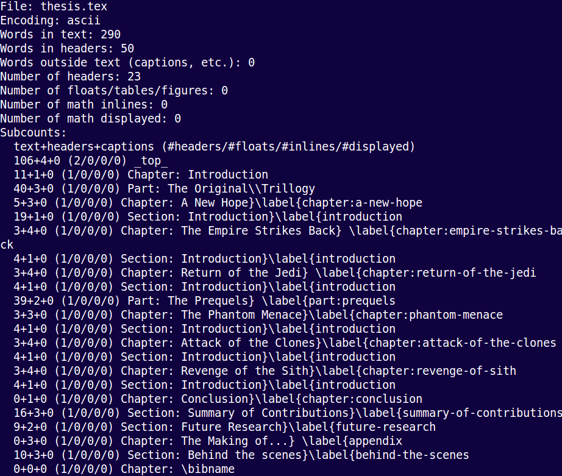
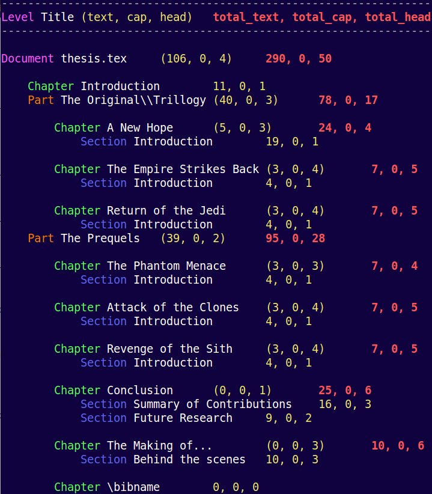

# prettytc

A Python script for pretty printing of TeXcount output.

TeXcount is excellent and by far the best way to produce wordcounts of LaTeX
documents but I found the output became hard to read for large documents.

`prettytc` is a Python script that runs TeXcount and parses the output in a
way that shows more of the document structure and provides totals at each
level. It can be run from the command line and any options are passed to
TeXcount.

## Comparison

### TeXcount output

```
texcount -merge thesis.tex
```



### prettytc output

```
prettytc --colour -merge thesis.tex
```


```

